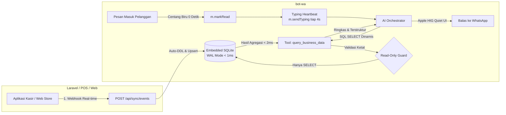

# Alexa

> **Autonomous WhatsApp Business Engine with Embedded Edge-Data Mirroring & Apple HIG Conversational UX.**  
> Built with Baileys, Fastify, and Node.js Native SQLite.

[](#requirements)
[](#rest-api)
[](#conversational-ux)
[-003B57?logo=sqlite&logoColor=white)](#edge-data-mirroring)
[](LICENSE)

---

## Overview

Alexa is an enterprise-grade WhatsApp automation engine designed for modern businesses, retail stores, and online services. Unlike rigid chatbot frameworks that require hardcoded endpoints or risk locking external databases with heavy queries, Alexa features an **Embedded Edge-Data Mirror** and **Apple HIG Conversational Mechanics**:

1. **Edge-Data Mirroring**: Replicates transactional records into an embedded local SQLite engine in WAL mode. Owners can ask complex questions (*"Who was the top-grossing cashier today?"*), and the AI executes microsecond local SQL queries without putting any load on production MySQL/cPanel databases.
2. **Apple HIG Conversational UX**: Messages receive an immediate 0-second double blue tick (`markRead`) and maintain a continuous 4-second typing heartbeat (`sendTyping`) during AI inference, eliminating customer anxiety and making waiting times feel natural.
3. **Universal Webhook & Delivery Engine**: Full REST API for outbound messaging, smart broadcasts with recursive Spintax, lifecycle delivery receipts (Queued ➔ Sent ➔ Delivered ➔ Read), and real-time webhook dispatching.
4. **Quiet Web Dashboard**: Clean macOS/iOS-inspired control plane featuring Inset Grouped Settings, Dual-Mode Knowledge Hub, and browser Visibility API battery guards.

---

## Architecture at a Glance



---

## Key Features

- **Embedded SQLite (WAL Mode)**: Ultra-fast local data store running inside Node.js natively. Zero external database dependencies, zero table locks on POS cashiers.
- **Autonomous Business Query Tool**: The AI inspects local schemas dynamically and runs safe `SELECT` queries to compute metrics in under 2 milliseconds, saving up to 90% LLM token usage.
- **Strict Read-Only Guard**: Mutation keywords (`INSERT`, `UPDATE`, `DELETE`, `DROP`, `ALTER`, `PRAGMA`) are strictly rejected at the engine level to prevent prompt injection attacks.
- **Immediate Read Receipts**: Instant double blue ticks acknowledge message reception within 0 seconds.
- **Persistent Typing Heartbeat**: Automatically refreshes the WhatsApp `composing` indicator every 4 seconds to bypass the native 5-second timeout while LLMs generate responses.
- **Anti-Ban Smart Broadcast**: Recursive Spintax generator, human jitter pacing (4s–8s), and automatic batch resting.
- **Universal Lifecycle Tracking**: Messages tracked from in-memory queue to carrier receipt with webhook callbacks (`message.delivered`, `message.read`).
- **Quiet Control Plane**: Built with Vanilla CSS adhering to Apple Human Interface Guidelines: no visual clutter, progressive disclosure drawers, and zero background battery drain via the Page Visibility API.

---

## Quick Start

### 1. Requirements
* Node.js **20.0+** (Node.js 22+ recommended for native `node:sqlite`)
* npm, pnpm, or yarn

### 2. Installation
```bash
# Clone the repository
git clone https://github.com/reyvanpurnama/alexa.git
cd alexa

# Install dependencies
npm install

# Copy environment configuration
cp .env.example .env
```

### 3. Essential Environment Variables
Configure your `.env` file with your preferred credentials:

```ini
# Server
PORT=3000
HOST=0.0.0.0
API_KEY=your_secure_api_key_here

# Bot Identity
BOT_NAME=Alexa
PREFIX=/
OWNER_NUMBERS=628123456789,628987654321

# AI Provider (gemini | openai | groq | deepseek | ollama | custom)
AI_PROVIDER=groq
AI_API_KEY=gsk_your_groq_api_key_here
AI_MODEL=openai/gpt-oss-120b
AI_AUTO_REPLY=true

# Optional: Outbound Webhook to your backend
WEBHOOK_URL=https://your-domain.com/api/whatsapp/webhook
WEBHOOK_SECRET=your_webhook_secret_key
```

### 4. Run Development Server
```bash
npm run dev
```

Open your browser at **`http://localhost:3000/dashboard`** to link your WhatsApp account via QR Code or 8-Digit Pairing Code.

---

## Universal Integration Guide (For Developers)

Connecting your Laravel, Django, Node, or POS backend to Alexa requires zero modifications to Alexa's source code.

### 1. Mirroring Real-Time Business Data
Push order receipts, inventory changes, or customer balances to Alexa whenever an event occurs in your database:

```bash
curl -X POST http://localhost:3000/api/sync/events \
  -H "Content-Type: application/json" \
  -H "x-api-key: your_secure_api_key_here" \
  -d '{
    "table": "pos_transactions",
    "action": "upsert",
    "primaryKey": "id",
    "data": {
      "id": 1054,
      "invoice_no": "INV-20260927-001",
      "total_amount": 75000,
      "cashier_name": "Fajar",
      "payment_method": "QRIS",
      "created_at": "2026-09-27 18:30:00"
    }
  }'
```
*Note: If the table or column does not exist yet, Alexa automatically creates and alters the schema on the fly (Auto-DDL).*

### 2. Sending Outbound Messages with Delivery Tracking
Dispatch notifications or verification OTPs. Pass `queued: true` to enable anti-ban pacing:

```bash
curl -X POST http://localhost:3000/api/send-message \
  -H "Content-Type: application/json" \
  -H "x-api-key: your_secure_api_key_here" \
  -d '{
    "to": "628123456789",
    "message": "Halo! Pesanan #1054 Anda sedang diproses oleh tim kami.",
    "queued": true,
    "referenceId": "ORDER-1054"
  }'
```

### 3. Querying Delivery Receipts
Check if a message was successfully delivered or read by the recipient:

```bash
curl -X GET "http://localhost:3000/api/messages/status?referenceId=ORDER-1054" \
  -H "x-api-key: your_secure_api_key_here"
```

### 4. Receiving Inbound Events (Webhooks)
When configured with `WEBHOOK_URL`, Alexa sends real-time HTTP POST notifications for:
- `message.received`: Customer sends a message or media.
- `payment.received`: Customer sends an image/PDF with payment receipt intent.
- `support.requested`: Customer asks for a human admin or types `/human`.

---

## Conversational AI & Knowledge Grounding

### Dual-Mode Knowledge Hub
- **Business Profile (`knowledge/business.md`)**: Provide store addresses, official bank accounts, operational hours, and warranty policies in clean Markdown.
- **FAQ Builder (`knowledge/faq.json`)**: Manage structured Question-Answer pairs categorized by topic directly from the Web Dashboard.
- **Zero Hallucinations**: Grounding prompts ensure the assistant strictly reflects your business facts.

### Human Takeover & Auto-Snooze
- **Owner Manual Reply**: When an owner replies directly from their phone in a private chat, AI auto-reply is automatically muted for 30 minutes to prevent interruptions.
- **Customer Handover**: When a customer requests a human agent (via `/human` or natural intent), the session is muted for 60 minutes and a webhook/alert is dispatched to the owners.
- **Manual Control**: Owners can silence or resume auto-replies at any time using `/mute [minutes]` and `/unmute`.

---

## REST API Reference

Swagger OpenAPI interactive documentation is available at `http://localhost:3000/docs`.

| Endpoint | Method | Scope | Description |
| :--- | :--- | :--- | :--- |
| `/api/status` | `GET` | Public | System uptime, connection state, and queue statistics |
| `/api/send-message` | `POST` | Protected | Send text message (immediate or queued anti-ban) |
| `/api/send-media` | `POST` | Protected | Send media (image, PDF document, video, voice note) |
| `/api/check-number` | `POST` | Protected | Check if phone number is registered on WhatsApp |
| `/api/messages/status` | `GET` | Protected | Query message delivery lifecycle by client `referenceId` |
| `/api/messages/recent` | `GET` | Protected | Inspect recent outbound messages and carrier ACKs |
| `/api/sync/events` | `POST` | Protected | Ingest real-time business records into local SQLite store |
| `/api/sync/status` | `GET` | Protected | View local database stats, tables, and active schema |
| `/api/sync/query` | `POST` | Protected | Admin safe query explorer (SELECT only) |
| `/api/broadcast` | `POST` | Protected | Launch campaign with Spintax, jitter pacing, and batch rest |
| `/api/broadcast/status` | `GET` | Protected | Monitor active broadcast progress and completion metrics |
| `/api/broadcast/pause` | `POST` | Protected | Pause running broadcast |
| `/api/broadcast/resume`| `POST` | Protected | Resume paused broadcast |
| `/api/broadcast/cancel`| `POST` | Protected | Cancel remaining broadcast targets |
| `/api/pairing` | `POST` | Protected | Request 8-digit WhatsApp pairing code |
| `/api/session/logout` | `POST` | Protected | Disconnect active WhatsApp session safely |
| `/api/sessions` | `GET` | Protected | List all saved session profiles on server |
| `/api/sessions/switch` | `POST` | Protected | Hot-swap active WhatsApp profile without re-pairing |
| `/api/knowledge` | `GET` | Protected | Inspect loaded knowledge documents and indexed chars |
| `/api/knowledge/reload`| `POST` | Protected | Force re-index knowledge documents from disk |
| `/api/settings` | `GET/PUT`| Protected | View or update runtime settings (delays, AI toggle, bot name)|
| `/api/settings/owners` | `POST` | Protected | Add new administrator phone number |
| `/api/settings/owners/:phone` | `DELETE` | Protected | Remove administrator phone number |

---

## Built-In Commands

The command prefix is configurable in `.env` (default: `/`). Mobile keyboard auto-spacing (e.g. `/ menu`) is automatically normalized.

| Command | Aliases | Scope | Description |
| :--- | :--- | :--- | :--- |
| `/menu` | `/help` | Public | Display available commands |
| `/ping` | `/p` | Public | Check bot response and network latency |
| `/info` | `/about` | Public | Display system runtime and Baileys version |
| `/human` | `/cs`, `/admin` | Public | Request immediate handover to a human representative |
| `/ai` | `/ask`, `/tanya` | Public | Ask AI assistant directly with typing heartbeat |
| `/reset` | `/clear` | Public | Clear personal multi-turn conversation memory |
| `/mute` | `/pause`, `/snooze` | Owner | Silence AI auto-replies in current conversation |
| `/unmute`| `/resume` | Owner | Re-enable AI auto-replies in current conversation |
| `/broadcast` | `/bc` | Owner | Launch and control Spintax broadcast campaigns |
| `/sessions` | `/profiles` | Owner | List all saved session profiles |
| `/switch` | `/changesession` | Owner | Switch active session profile |
| `/reloadkb`| `/refreshkb` | Owner | Reload and re-index business knowledge documents |
| `/logout` | `/disconnect` | Owner | Log out current WhatsApp connection |

---

## Project Structure

```text
alexa/
├── data/                       # Embedded SQLite store (gitignored)
│   └── local_store.sqlite      # Real-time WAL edge replica
├── docs/                       # Architectural blueprints & technical specs
├── knowledge/                  # Grounding documents
│   ├── business.md             # Markdown business profile & policies
│   └── faq.json                # Structured FAQ entries
├── public/dashboard/           # Apple HIG Quiet Web Dashboard
│   ├── css/dashboard.css       # Unified Apple design tokens & grouped list styles
│   ├── js/                     # Modular frontend with Visibility API guard
│   └── index.html              # Bento grid layout with progressive disclosure
├── src/
│   ├── commands/               # Modular commands (general, ai, automation)
│   ├── config/                 # Zod environment schemas & settings manager
│   ├── core/                   # Baileys socket, serializer, & command manager
│   │   └── store/              # Embedded SQLite core with Read-Only Guard
│   ├── handlers/               # Inbound message event dispatcher (0s markRead)
│   ├── queue/                  # Anti-ban queue throttler with jitter
│   ├── server/                 # Fastify REST API, Swagger UI, & Web Dashboard
│   │   └── routes/api/         # Modular endpoints (sync, messages, sessions, etc.)
│   ├── services/
│   │   ├── ai/                 # Multi-provider LLM engine, memory, & tools
│   │   ├── alerts/             # Real-time owner notifications & payment forwarding
│   │   ├── messages/           # Message lifecycle tracker & LRU cache
│   │   └── sync/               # Incremental data catch-up reconciler worker
│   ├── types/                  # TypeScript interfaces & definitions
│   └── utils/                  # Logger, webhook dispatcher, & Spintax parser
├── package.json
└── tsconfig.json
```

---

## Production Deployment

### Standard Node.js
```bash
npm run build
npm start
```

### Docker
```bash
docker compose up -d
```

---

## License

This project is licensed under the [MIT License](LICENSE).
